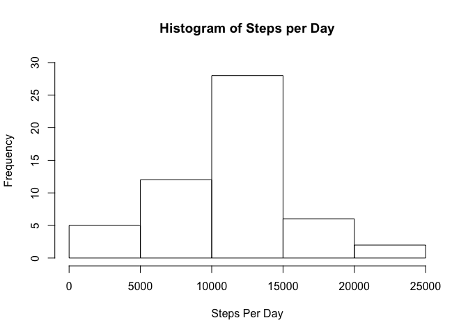
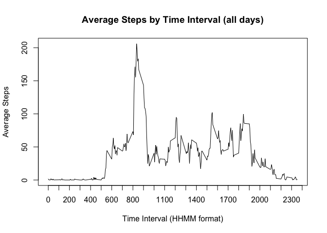
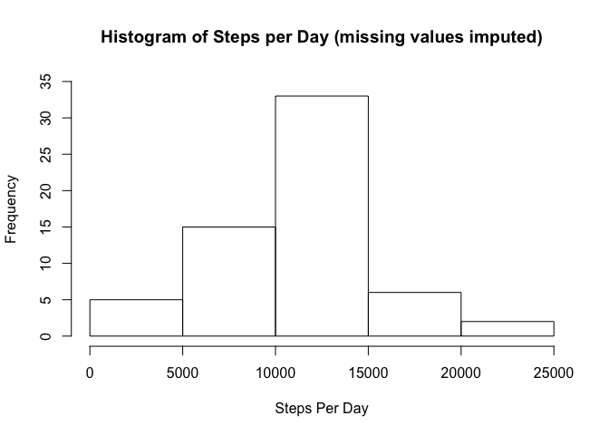
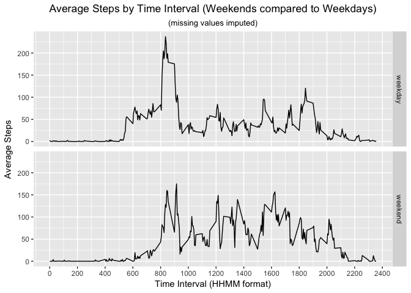

---
title: "Reproducible Research: Peer Assessment 1"
author: "Eric Allen"
date: "12/30/2018"
output: 
  html_document:
    keep_md: true
---


# Introduction

It is now possible to collect a large amount of data about personal movement using activity monitoring devices such as a Fitbit, Nike Fuelband, or Jawbone Up. These type of devices are part of the “quantified self” movement – a group of enthusiasts who take measurements about themselves regularly to improve their health, to find patterns in their behavior, or because they are tech geeks. But these data remain under-utilized both because the raw data are hard to obtain and there is a lack of statistical methods and software for processing and interpreting the data.

This assignment makes use of data from a personal activity monitoring device. This device collects data at 5 minute intervals through out the day. The data consists of two months of data from an anonymous individual collected during the months of October and November, 2012 and include the number of steps taken in 5 minute intervals each day.

The data for this assignment can be downloaded from the course web site:

The variables included in this dataset are:

* steps: Number of steps taking in a 5-minute interval (missing values are coded as NA)
* date: The date on which the measurement was taken in YYYY-MM-DD format
* interval: Identifier for the 5-minute interval in which measurement was taken

The dataset is stored in a comma-separated-value (CSV) file and there are a total of 17,568 observations in this dataset.

## Loading and preprocessing the data

### 1.0 Code for reading in the dataset and/or processing the data

Loading and preprocessing the data

Show any code that is needed to

1. Load the data (i.e.read.csv())
2. Process/transform the data (if necessary) into a format suitable for your analysis


```r
unzip("activity.zip")
actdf <- read.csv("activity.csv")

# convert date into a data format

actdf$date <- as.Date(actdf$date, format = "%Y-%m-%d")
```

```
## Warning in strptime(x, format, tz = "GMT"): unknown timezone 'zone/tz/
## 2018g.1.0/zoneinfo/America/Chicago'
```

## What is mean total number of steps taken per day?

### 2.0 Histogram of the total number of steps taken each day

For this part of the assignment, you can ignore the missing values in the dataset.

1. Calculate the total number of steps taken per day


```r
# summarize the data - steps by day

daystep <- tapply(actdf$steps, actdf$date, sum)

# calculate the histogram - breaks = days

hist(daystep, ylim = c(0,30), xlab = "Steps Per Day", main = "Histogram of Steps per Day")
```

<!-- -->

### 3.0 Calculate and report the mean and median of the total number of steps taken per day


```r
mean(daystep, na.rm = TRUE)
```

```
## [1] 10766.19
```


```r
median(daystep, na.rm = TRUE)
```

```
## [1] 10765
```

## What is the average daily activity pattern?

### 4.0 Time series plot of the average number of steps taken

1. Make a time series plot (i.e. type="l") of the 5-minute interval (x-axis) and the average number of steps taken, averaged across all days (y-axis)


```r
avgdf <- aggregate(steps~interval, actdf, mean)
plot(avgdf$interval, avgdf$steps, type = "l", xaxp = c(0,2400,24), 
     ylab = "Average Steps", xlab = "Time Interval (HHMM format)", 
     main = "Average Steps by Time Interval (all days)")
```

<!-- -->

### 5.0 The 5-minute interval that, on average, contains the maximum number of steps

2. Which 5-minute interval, on average across all the days in the dataset, contains the maximum number of steps?


```r
avgdf[avgdf$steps==max(avgdf$steps),]
```

```
##     interval    steps
## 104      835 206.1698
```

## Imputing missing values

### 6.0 Code to describe and show a strategy for imputing missing data

Imputing missing values

Note that there are a number of days/intervals where there are missing values (coded as NA). The presence of missing days may introduce bias into some calculations or summaries of the data.

1. Calculate and report the total number of missing values in the dataset (i.e. the total number of rows with NAs)


```r
summary(actdf)
```

```
##      steps             date               interval     
##  Min.   :  0.00   Min.   :2012-10-01   Min.   :   0.0  
##  1st Qu.:  0.00   1st Qu.:2012-10-16   1st Qu.: 588.8  
##  Median :  0.00   Median :2012-10-31   Median :1177.5  
##  Mean   : 37.38   Mean   :2012-10-31   Mean   :1177.5  
##  3rd Qu.: 12.00   3rd Qu.:2012-11-15   3rd Qu.:1766.2  
##  Max.   :806.00   Max.   :2012-11-30   Max.   :2355.0  
##  NA's   :2304
```

```r
# day's without observations
unique(actdf[is.na(actdf$steps), ]$date)
```

```
## [1] "2012-10-01" "2012-10-08" "2012-11-01" "2012-11-04" "2012-11-09"
## [6] "2012-11-10" "2012-11-14" "2012-11-30"
```

```r
stepsNA <- sum(is.na(actdf$steps))
```

The 'steps' field is missing 2304 observations. Which appears to be the result of observations not being taken for the entirety of 8 dates.

2. Devise a strategy for filling in all of the missing values in the dataset. The strategy does not need to be sophisticated. For example, you could use the mean/median for that day, or the mean for that 5-minute interval, etc.

Missing values will be filled with the mean steps taken for that interval on the same weekday as the missing values.


```r
# identify the weekdays
actdf$weekday <- as.factor(weekdays(actdf$date))

# compute the average for the weekeday interval combinations
avgday <- aggregate(steps~interval+weekday, actdf, mean)
```


3. Create a new dataset that is equal to the original dataset but with the missing data filled in.


```r
# merge on avgday steps based on weekday and interval

allin <- merge(actdf, avgday, c("weekday","interval"))

# create imputed steps

allin$impstep <- with(allin, ifelse(is.na(steps.x), steps.y, steps.x))
```

### 7.0  Histogram of the total number of steps taken each day after missing values are imputed

Make a histogram of the total number of steps taken each day and Calculate and report the mean and median total number of steps taken per day. Do these values differ from the estimates from the first part of the assignment? What is the impact of imputing missing data on the estimates of the total daily number of steps?


```r
# summarize the data - steps by day

daystep2 <- tapply(allin$impstep, allin$date, sum)

# calculate the histogram - breaks = days

hist(daystep2, ylim = c(0,35), xlab = "Steps Per Day", main = "Histogram of Steps per Day (missing values imputed)")
```

<!-- -->


```r
mean(daystep2, na.rm = TRUE)
```

```
## [1] 10821.21
```


```r
median(daystep2, na.rm = TRUE)
```

```
## [1] 11015
```

Imputing the missing values increased the total number of steps taken per day along with the mean and median number of steps per day.  

## Are there differences in activity patterns between weekdays and weekends?

### 8.0 Panel plot comparing the average number of steps taken per 5-minute interval across weekdays and weekends

1. Create a new factor variable in the dataset with two levels – “weekday” and “weekend” indicating whether a given date is a weekday or weekend day.


```r
allin$dayend <- with(allin, ifelse(weekday == "Saturday"|weekday == "Sunday", 
                                  "weekend", "weekday"))
```


2. Make a panel plot containing a time series plot (i.e. type="l") of the 5-minute interval (x-axis) and the average number of steps taken, averaged across all weekday days or weekend days (y-axis). 


```r
avgday2 <- aggregate(impstep~interval+dayend, allin, mean)

library(ggplot2)

avgday2plot <- ggplot(data = avgday2, aes(x = interval, y=impstep))+ 
  geom_line()+
  scale_x_continuous(breaks = seq(0,2400,by=200))+
  labs(title = "Average Steps by Time Interval (Weekends compared to Weekdays)",
       x="Time Interval (HHMM format)",y="Average Steps",
       subtitle="(missing values imputed)")+
  theme(plot.title = element_text(hjust = 0.5), plot.subtitle = element_text(hjust = 0.5))+
  facet_grid(dayend~.)      
avgday2plot
```

<!-- -->


### 9.0 All of the R code needed to reproduce the results (numbers, plots, etc.) in the report

(all code incuded above)

